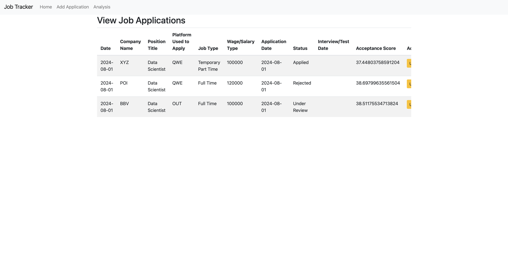
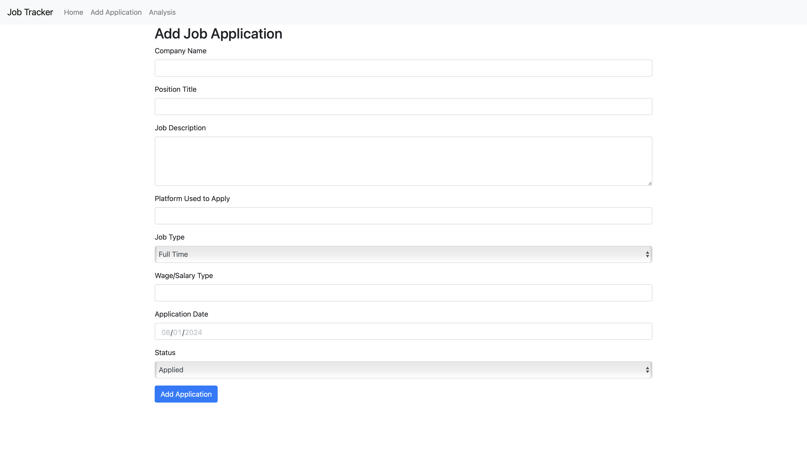
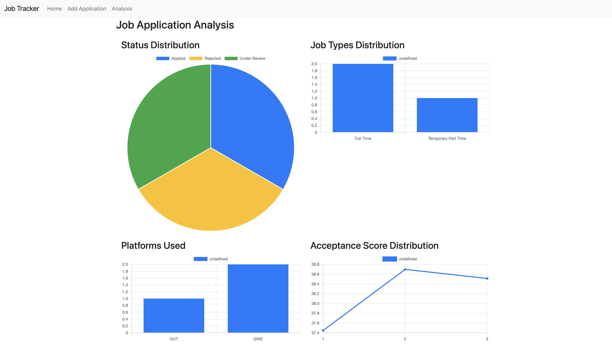

# job-tracker-v2

This Flask web application helps users track their job applications, analyze the status of their applications, and calculate the acceptance score based on their CV and job descriptions. The app uses PyPDF2 for extracting text from PDF files and Scikit-learn for calculating cosine similarity between the CV and job descriptions.

## What Problem This Project Solves

Job seekers often apply to multiple positions across different companies and platforms, making it challenging to keep track of all their applications. This project provides a solution to:

- Organize Job Applications: Helps users manage and organize their job applications in one place.
- Monitor Application Status: Allows users to update and monitor the status of their applications.
- Analyze Job Search Efforts: Provides analytical insights into the types of jobs applied for, platforms used, and the overall status of applications.
- Calculate Acceptance Probability: Estimates the acceptance score by comparing the CV with job descriptions, aiding users in identifying job matches.

## Features

- Add job applications with detailed information.
- View and update the status of job applications.
- Analyze the status counts, job types, and platforms used to apply.
- Calculate and display the acceptance score based on the CV and job descriptions.

## Prerequisites

- Python 3.7+
- Flask
- Pandas
- PyPDF2
- Scikit-learn

## Screenshots





## Installation

1. **Clone the repository:**

    ```bash
    git clone https://github.com/hemangsharma/job-tracker-v2
    cd job-tracker-v2
    ```

2. **Create and activate a virtual environment:**

    ```bash
    python3 -m venv venv
    source venv/bin/activate
    ```

3. **Install the dependencies:**

    ```bash
    pip install -r requirements.txt
    ```

4. **Place your CV PDF in the `data` directory:**

    Make sure your CV is named `cv.pdf` and placed inside the `data` directory.

5. **Run the application:**

    ```bash
    flask run
    ```

    The application will be available at `http://127.0.0.1:5000/`.

## Usage

### Adding a Job Application

1. Navigate to `http://127.0.0.1:5000/add`.
2. Fill out the form with the job application details.
3. Submit the form to save the application.

### Viewing Job Applications

1. Navigate to `http://127.0.0.1:5000/view`.
2. View the list of all job applications and their details.

### Updating a Job Application

1. Navigate to `http://127.0.0.1:5000/view`.
2. Click on the "Update" button next to the application you want to update.
3. Modify the status and interview/test date, then submit the form.

### Analyzing Job Applications

1. Navigate to `http://127.0.0.1:5000/analysis`.
2. View the analysis of job applications including status counts, job types, platforms used, and acceptance scores.

## Project Structure


| File/Folder         | Description                                       |
|---------------------|---------------------------------------------------|
| `app.py`            | Main Flask application file                       |
| `requirements.txt`  | List of dependencies                              |
| `templates/`        | Directory containing HTML templates               |
| `base.html`         | Base HTML template                                |
| `add.html`          | Template for adding job applications              |
| `view.html`         | Template for viewing job applications             |
| `analysis.html`     | Template for analyzing job applications           |
| `update.html`       | Template for updating job applications            |
| `data/`             | Directory for storing application data            |
| `applications.csv`  | CSV file storing job application details          |
| `cv.pdf`            | PDF file of the user's CV                         |


## License

This project is licensed under the MIT License. See the [LICENSE](LICENSE) file for details.

## Contributing

If you would like to contribute to this project, please create a pull request with a detailed description of your changes.


